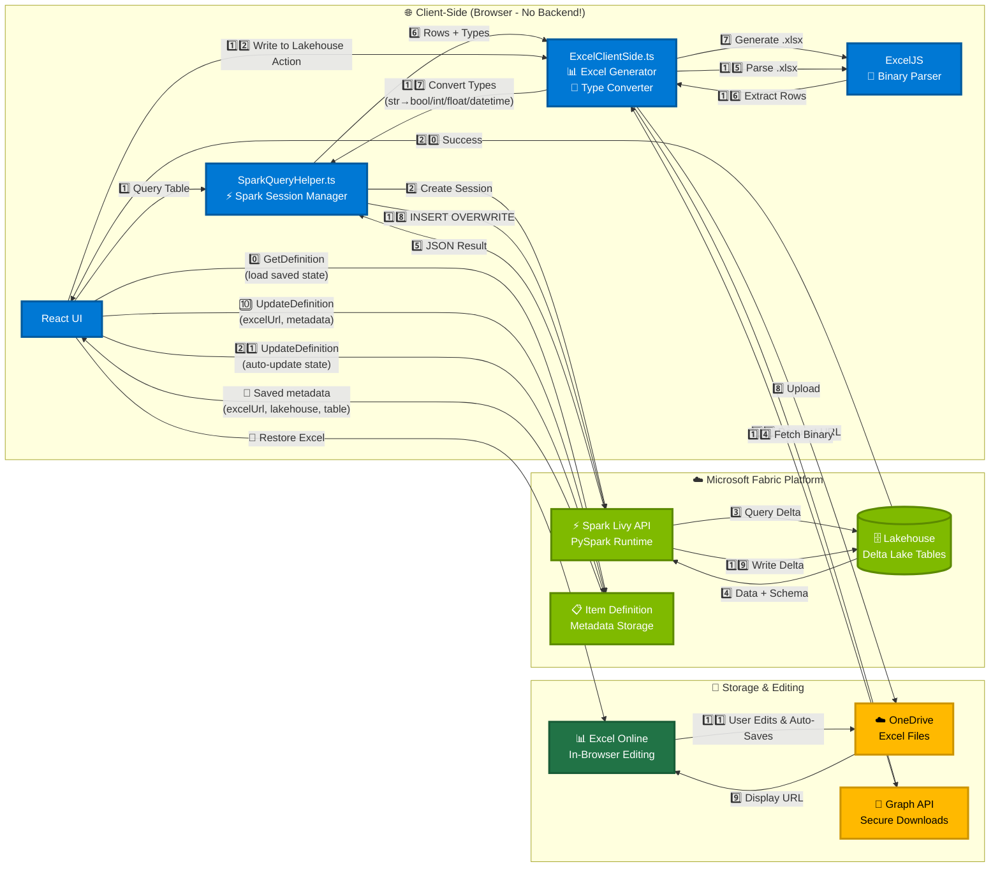

# Excel Workload - Fabric-Native Excel Editing

## Overview

The Excel Workload provides a complete Fabric-native solution for editing Lakehouse data with Excel capabilities, all without leaving the Microsoft Fabric environment. This workload demonstrates a **100% client-side architecture** that leverages Spark for compute and Excel Online for editing—no custom backend required.

## 🏗️ Architecture Overview



### 📖 Architecture Explained

**Three Main Flows:**

1. **🔄 LOAD (Item Open → Restore State)** - Step 0
   - User opens existing ExcelEdit item in Fabric
   - **Item Definition retrieved** via `getItemDefinition()`
   - Saved metadata loaded (Excel URL, lakehouse ID, table name, last save timestamp)
   - Excel Online iframe automatically displays saved workbook
   - User continues editing from where they left off

2. **📥 READ (Lakehouse → Excel)** - Steps 1-10
   - User requests data from lakehouse table (first time or refresh)
   - Spark queries Delta Lake and returns data with schema
   - Client generates Excel file in browser (ExcelJS)
   - File uploaded to OneDrive, displayed in Excel Online
   - **Item Definition updated** with Excel URL and metadata via `updateItemDefinition()`

3. **📤 WRITE (Excel → Lakehouse)** - Steps 11-21
   - User edits in Excel Online, changes auto-save to OneDrive
   - User triggers "Write to Lakehouse" action from ribbon
   - Client downloads Excel file securely via Graph API
   - Client parses binary Excel in browser (ExcelJS)
   - Client converts Excel strings to proper Python types
   - Spark writes back to Delta Lake using SQL INSERT OVERWRITE
   - **Item Definition automatically updated** with success status and timestamp

**🔄 Item Definition API Usage:**
- **`getItemDefinition()`**: Load saved state when item opens
  - Returns: Excel file URL, lakehouse ID, table name, schema info, last save timestamp
  - Enables seamless resume of work session
  
- **`updateItemDefinition()`**: Auto-persist state at key workflow transitions
  - After lakehouse/table selection: Save selection metadata
  - After Excel creation: Save Excel URL and configuration
  - After lakehouse write: Update success status and timestamp
  - After any user action: Update item state automatically
  - No manual save needed - state always synchronized with Fabric

### Key Architectural Principles

**🎯 100% Client-Side Processing**
- No backend server required for Excel operations
- All parsing and generation happens in the browser
- ExcelJS library handles binary Excel format client-side
- Reduces infrastructure complexity and costs

**🔄 Bidirectional Data Flow**
- **Read**: Lakehouse → Spark → JSON → Excel generation → OneDrive → Excel Online
- **Write**: Excel Online → OneDrive → Binary fetch → Parse → Type conversion → Spark → Lakehouse

**🎨 Type Preservation**
- Schema extracted during read operation
- Original types preserved through entire round-trip
- Intelligent conversion: Excel strings → Python types
- Delta Lake compatibility via SQL INSERT OVERWRITE

**⚡ Spark Livy API Integration**
- Session pooling and reuse for performance
- Direct PySpark code execution
- No intermediate data storage required
- Leverages Fabric's native compute

## Features

### 🏠 **Fabric-Native Architecture**
- **DataHub Integration**: Select lakehouses using Fabric's DataHub SDK
- **Excel Online**: Edit data directly in embedded Excel interface
- **OneLake Storage**: Save edited data directly to OneLake folders
- **No External Navigation**: Complete experience within Fabric

### 📊 **Workflow Steps**

1. **Lakehouse Selection** 
   - Browse available lakehouses via DataHub SDK
   - Filter by workspace and permissions
   - Real-time lakehouse discovery

2. **Table Selection**
   - View table metadata (columns, row count, last modified)
   - Preview table schema and data types
   - Support for multiple data types (string, decimal, datetime, int)

3. **Excel Creation with Schema Preservation**
   - Query lakehouse table via Spark Livy API
   - Extract original schema for type-aware operations
   - Generate Excel file with real data (up to 1000 rows)
   - Professional styling with Microsoft blue headers

4. **Excel Editing**
   - Integration with Excel Online via OneDrive for Business
   - In-Fabric Excel editing capabilities
   - Live data preview and manipulation
   - Professional Excel experience without leaving Fabric

5. **OneLake Storage**
   - Auto-save edited data to user's OneLake folders
   - Automatic file naming with timestamps
   - Preservation of data formatting

6. **Save to Lakehouse with Type Preservation**
   - Parse Excel file client-side using ExcelJS
   - Validate schema compatibility with original table
   - Convert Excel strings to proper Spark types:
     - Boolean: `"true"` → `True`, `"false"` → `False`
     - Integer/Long: `"42"` → `42`
     - Float/Double: `"3.14"` → `3.14`
     - Timestamp: `"2023-01-01T00:00:00"` → Python datetime
     - String: Preserved as-is
   - Execute SQL INSERT OVERWRITE for Delta Lake compatibility
   - Preserve Delta Lake transaction history

## 🔧 Technical Implementation

### Key Components
- **ExcelEditItemEditor.tsx**: Main workflow component with state management
- **ExcelClientSide.ts**: Client-side Excel generation and lakehouse write operations (722 lines)
- **SparkQueryHelper.ts**: Spark Livy session management and query execution (346 lines)
- **WorkflowState enum**: State management for multi-step process
- **LakehouseInfo/TableInfo interfaces**: TypeScript type safety

### Data Flow Details

**Read Path (Lakehouse → Excel):**
1. **DataHub SDK** → List lakehouses and tables
2. **Spark Livy API** → Query table data with schema extraction
3. **SparkQueryHelper** → Execute PySpark code and poll for results
4. **ExcelClientSide** → Generate Excel file with styled headers
5. **Excel Online** → Display in embedded iframe for editing

**Write Path (Excel → Lakehouse):**
1. **Graph API** → Download Excel file using `@microsoft.graph.downloadUrl`
2. **ExcelJS** → Parse Excel binary data client-side
3. **Type Conversion** → Convert Excel strings to Spark types
4. **Spark Livy API** → Create DataFrame with original schema
5. **SQL INSERT OVERWRITE** → Write to Delta Lake table via temp view

### Type Conversion Implementation

**Boolean Conversion:**
```typescript
if (field.type === 'BooleanType') {
  convertedValue = value.toLowerCase() === 'true';
}
```

**Numeric Conversion:**
```typescript
if (field.type === 'IntegerType' || field.type === 'LongType') {
  convertedValue = parseInt(value, 10);
}
if (field.type === 'FloatType' || field.type === 'DoubleType') {
  convertedValue = parseFloat(value);
}
```

**Timestamp Conversion:**
```typescript
if (field.type === 'TimestampType') {
  convertedValue = `datetime.fromisoformat("${value}")`;
}
```

### SQL INSERT OVERWRITE Approach

```python
# Create DataFrame with original schema
df = spark.createDataFrame(data, schema)

# Create temporary view for SQL operation
df.createOrReplaceTempView("temp_insert_view")

# Use INSERT OVERWRITE for Delta Lake compatibility
spark.sql(f"INSERT OVERWRITE TABLE {table_name} SELECT * FROM temp_insert_view")
```

## 🚀 Usage Scenario

**Business Analyst Workflow:**
1. **Create ExcelEdit Item**: User creates new ExcelEdit item in their workspace
2. **Connect to Data**: Select relevant lakehouse (e.g., "Sales Analytics")
3. **Choose Dataset**: Pick table (e.g., "Monthly Sales Performance") 
4. **Edit in Excel**: Use familiar Excel interface within Fabric
5. **Save to Lakehouse**: Write changes back with automatic type preservation
6. **Share Results**: Data persists in OneLake for team collaboration

## 📦 Dependencies

- `exceljs` (^4.4.0): Client-side Excel file parsing and generation
- `@ms-fabric/workload-client`: Fabric SDK integration
- `@fluentui/react-components`: UI components
- **Fabric REST APIs**:
  - Lakehouse API: Get lakehouse properties and table lists
  - Spark Livy API: Session management and query execution
  - Microsoft Graph API: Excel file downloads and OneDrive integration
- **DataHub SDK**: Lakehouse discovery
- **OneLake SDK**: File storage integration

## 🛠 Development Status

### ✅ Completed Features
- **Real lakehouse data** queried via Spark Livy API
- **Schema preservation** from lakehouse to Excel and back
- **Type conversion** for Boolean, Long, Double, String, Timestamp, Date types
- **Excel Online integration** via OneDrive for Business
- **SQL INSERT OVERWRITE** for Delta Lake compatibility
- **Client-side Excel processing** - no backend required for parsing
- **Error handling** with validation and detailed error messages
- **Session pooling** for Spark Livy performance optimization

### 🔄 Future Enhancements
- **Pagination**: Support for tables > 1000 rows
- **Incremental updates**: Track and sync only changed cells
- **Conflict resolution**: Handle concurrent edits
- **Audit logging**: Track who edited what and when

## 📋 Configuration

The Excel workload is configured in:
- **Environment**: `.env.dev` - `ITEM_NAMES=HelloWorld,ExcelEdit`
- **Manifest**: `Product.json` - Workload card configuration
- **Routing**: `App.tsx` - Route registration for ExcelEdit item
- **Translations**: Multi-language support via i18n

## 🔍 Getting Started

### Prerequisites
- Microsoft Fabric workspace with capacity
- Lakehouse with Delta Lake tables
- OneDrive for Business account

### Running the Workload
1. Start development server: 
   ```powershell
   d:\Git\FET\fabric-extensibility-toolkit\scripts\Run\StartDevServer.ps1
   ```
2. Open browser: `http://localhost:60006`
3. Navigate to ExcelEdit item
4. Follow the guided workflow steps

### Project Structure
```
Workload/
├── app/
│   ├── items/
│   │   └── ExcelEditItem/
│   │       ├── ExcelEditItemEditor.tsx          # Main UI component
│   │       ├── ExcelEditItemEditorDefault.tsx   # Canvas management
│   │       └── ExcelEditItemEditorRibbon.tsx    # Toolbar actions
│   ├── clients/
│   │   └── ExcelClientSide.ts                   # Excel operations (722 lines)
│   └── services/
│       └── SparkQueryHelper.ts                  # Spark integration (346 lines)
├── package.json                                 # Dependencies (exceljs, etc.)
└── tsconfig.json                                # TypeScript configuration
```

## 🎯 Business Value

- **Familiar Interface**: Excel editing experience analysts know and trust
- **Secure Environment**: No data leaves Fabric ecosystem  
- **Integrated Workflow**: Seamless lakehouse-to-analysis-to-lakehouse pipeline
- **Collaborative**: OneLake storage enables team sharing
- **Governed**: Fabric security, compliance, and audit trails maintained
- **Cost-Effective**: No additional infrastructure required
- **Scalable**: Leverages Fabric's native Spark compute