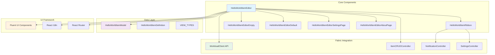
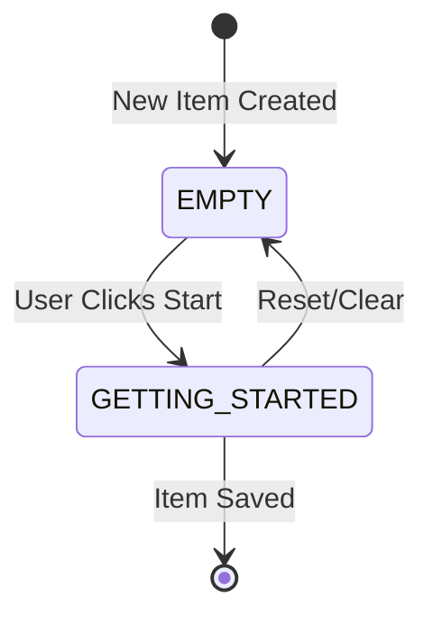

# HelloWorld Item - Architecture

## System Architecture



## Component Architecture

### HelloWorldItemEditor (Main Component)

**Primary orchestrator managing the complete item lifecycle**

```typescript
interface EditorState {
  isLoading: boolean;
  item: ItemWithDefinition<HelloWorldItemDefinition>;
  currentView: CurrentView;
  hasBeenSaved: boolean;
}
```

#### Core Responsibilities

**Item Lifecycle Management**
- Load existing items via `getWorkloadItem`
- Initialize new items with default definition
- Handle save operations with `saveItemDefinition`
- Manage item state transitions

**View Orchestration**
```typescript
const renderCurrentView = () => {
  switch (currentView) {
    case VIEW_TYPES.EMPTY:
      return <HelloWorldItemEditorEmpty />;
    case VIEW_TYPES.GETTING_STARTED:
      return <HelloWorldItemEditorDefault />;
    default:
      return <HelloWorldItemEditorEmpty />;
  }
};
```

**URL Parameter Handling**
- Parse `itemObjectId` from route parameters
- Handle create vs edit scenarios
- Proper navigation state management

### HelloWorldItemRibbon (Toolbar)

**Provides consistent action interface following Fabric patterns**

#### Key Features
- **Primary Actions**: Save, settings, and navigation buttons
- **Context Sensitivity**: Actions adapt based on current view state
- **Fabric Integration**: Proper integration with platform services
- **Accessibility**: Full keyboard navigation and screen reader support

#### Implementation Pattern
```typescript
export function HelloWorldItemRibbon(props: RibbonProps) {
  const { item, onSave, currentView } = props;
  
  const actions = useMemo(() => [
    {
      key: 'save',
      text: t('Save'),
      onClick: onSave,
      disabled: !hasChanges
    },
    {
      key: 'settings',
      text: t('Settings'),
      onClick: () => callOpenSettings()
    }
  ], [hasChanges, onSave]);
  
  return <RibbonContainer actions={actions} />;
}
```

### HelloWorldItemEditorEmpty (Onboarding)

**First-time user experience and onboarding flow**

#### Design Principles
- **Visual Hierarchy**: Clear visual progression from image to action
- **Call-to-Action**: Single primary action to move forward
- **Branding**: Consistent with Fabric visual design
- **Customizable**: Easy to replace or remove for specific use cases

#### Component Structure
```typescript
interface EmptyStateProps {
  workloadClient: WorkloadClientAPI;
  item?: ItemWithDefinition<HelloWorldItemDefinition>;
  onNavigateToGettingStarted: () => void;
}
```

**Asset Management**
- SVG illustrations for scalability
- Proper alt text for accessibility
- Responsive image sizing
- Theme-aware graphics

### HelloWorldItemEditorDefault (Main View)

**Primary content interface where users perform main tasks**

#### Extensibility Points
- **Content Area**: Flexible content rendering
- **Action Handlers**: Customizable user interactions
- **State Integration**: Proper definition state binding
- **Validation**: Input validation and error handling

### Data Models and State Management

#### HelloWorldItemDefinition

```typescript
interface HelloWorldItemDefinition {
  state?: string;  // Flexible state storage for extension
}
```

**Design Philosophy**
- **Minimal Structure**: Simple foundation for extension
- **Type Safety**: Full TypeScript support
- **Extensibility**: Easy to extend for specific use cases
- **Backward Compatibility**: Graceful handling of undefined properties

#### View State Management

```typescript
const VIEW_TYPES = {
  EMPTY: 'empty',
  GETTING_STARTED: 'getting-started'
} as const;

type CurrentView = typeof VIEW_TYPES[keyof typeof VIEW_TYPES];
```

**State Transitions**


## Integration Architecture

### Fabric Platform Integration

#### WorkloadClient API Integration
```typescript
async function loadDataFromUrl(pageContext: ContextProps): Promise<void> {
  if (pageContext.itemObjectId) {
    // Edit scenario - load existing item
    const loadedItem = await getWorkloadItem<HelloWorldItemDefinition>(
      workloadClient,
      pageContext.itemObjectId
    );
    
    // Ensure proper definition initialization
    if (!loadedItem.definition) {
      loadedItem.definition = { state: undefined };
    }
    
    setItem(loadedItem);
  } else {
    // Create scenario - initialize new item
    const newItem = await callGetItem<HelloWorldItemDefinition>(pageContext);
    setItem(newItem);
  }
}
```

#### Save Operations
```typescript
async function handleSave(): Promise<void> {
  try {
    const updatedItem = await saveItemDefinition(
      workloadClient,
      item.id,
      item.definition
    );
    
    setItem(updatedItem);
    setHasBeenSaved(true);
    
    callNotificationOpen({
      type: 'success',
      message: t('Item saved successfully')
    });
  } catch (error) {
    callNotificationOpen({
      type: 'error', 
      message: t('Save failed: ') + error.message
    });
  }
}
```

### React Router Integration

#### URL Parameter Handling
- **itemObjectId**: Unique identifier for existing items
- **workspaceObjectId**: Workspace context
- **pathname**: Current route for navigation state

#### Navigation Patterns
```typescript
const pageContext = useParams<ContextProps>();
const { pathname } = useLocation();

useEffect(() => {
  loadDataFromUrl(pageContext, pathname);
}, [pageContext, pathname]);
```

### Internationalization Architecture

#### React i18n Integration
```typescript
const { t } = useTranslation();

// Usage in components
<Text>{t('HelloWorldItemEditorEmpty_Title', 'Welcome to HelloWorld!')}</Text>
```

#### Translation Key Patterns
- **Component_Element_Context**: Structured naming convention
- **Default Values**: Fallback text for missing translations
- **Namespacing**: Organized by component or feature area

## Development Patterns

### Component Composition Pattern

```typescript
export function HelloWorldItemEditor(props: PageProps) {
  return (
    <Stack className="hello-world-editor">
      <HelloWorldItemRibbon {...ribbonProps} />
      <Stack.Item grow>
        {renderCurrentView()}
      </Stack.Item>
    </Stack>
  );
}
```

### State Management Pattern

```typescript
// Immutable state updates
const updateDefinition = (updates: Partial<HelloWorldItemDefinition>) => {
  setItem(prevItem => ({
    ...prevItem,
    definition: {
      ...prevItem.definition,
      ...updates
    }
  }));
};
```

### Error Handling Pattern

```typescript
async function safeAsyncOperation<T>(
  operation: () => Promise<T>,
  errorMessage: string
): Promise<T | null> {
  try {
    return await operation();
  } catch (error) {
    console.error(errorMessage, error);
    callNotificationOpen({
      type: 'error',
      message: `${errorMessage}: ${error.message}`
    });
    return null;
  }
}
```

## Extensibility Architecture

### Template Customization Points

#### 1. Data Model Extension
```typescript
// Extend the base definition
interface CustomItemDefinition extends HelloWorldItemDefinition {
  customField: string;
  additionalData: CustomData[];
  settings: ItemSettings;
}
```

#### 2. View Addition
```typescript
const CUSTOM_VIEW_TYPES = {
  ...VIEW_TYPES,
  ADVANCED: 'advanced',
  SETTINGS: 'settings'
} as const;
```

#### 3. Component Replacement
```typescript
// Replace default components with custom implementations
const CustomEditor = (props: EditorProps) => {
  // Custom implementation
  return <CustomEditorImplementation {...props} />;
};
```

### Plugin Architecture

#### Custom Action Registration
```typescript
interface CustomAction {
  key: string;
  text: string;
  icon?: string;
  onClick: () => void;
  visible?: boolean;
  disabled?: boolean;
}

const registerCustomActions = (actions: CustomAction[]) => {
  // Register actions with ribbon
};
```

#### Event Hooks
```typescript
interface ItemLifecycleHooks {
  onItemLoaded?: (item: ItemWithDefinition) => void;
  onBeforeSave?: (definition: ItemDefinition) => boolean;
  onAfterSave?: (item: ItemWithDefinition) => void;
  onViewChanged?: (newView: CurrentView) => void;
}
```

### Asset Management

#### Image Assets
- **Location**: `/assets/items/HelloWorldItem/`
- **Formats**: SVG for scalability, PNG fallbacks
- **Naming**: Descriptive names with consistent casing
- **Organization**: Grouped by usage (cards, empty states, icons)

#### CSS Classes
```scss
.hello-world-editor {
  display: flex;
  flex-direction: column;
  height: 100%;
  
  .empty-state-container {
    display: flex;
    align-items: center;
    justify-content: center;
    height: 100%;
  }
}
```

## Performance Considerations

### Lazy Loading
- Components loaded only when needed
- Proper React.lazy() implementation for large components
- Route-based code splitting

### State Optimization
- Minimal re-renders through proper dependency arrays
- Memoization of expensive computations
- Efficient state updates with immutable patterns

### Memory Management
- Proper cleanup in useEffect hooks
- Disposal of subscriptions and event listeners
- Optimized asset loading and caching

## Testing Architecture

### Component Testing
```typescript
describe('HelloWorldItemEditor', () => {
  it('loads item from URL parameters', async () => {
    const mockItem = createMockItem();
    jest.mocked(getWorkloadItem).mockResolvedValue(mockItem);
    
    render(<HelloWorldItemEditor {...defaultProps} />);
    
    await waitFor(() => {
      expect(screen.getByText('Welcome')).toBeInTheDocument();
    });
  });
});
```

### Integration Testing
- End-to-end user workflows
- Fabric platform API integration
- State persistence and recovery
- Error scenario handling

This architecture provides a solid foundation for Fabric item development while maintaining flexibility for customization and extension.